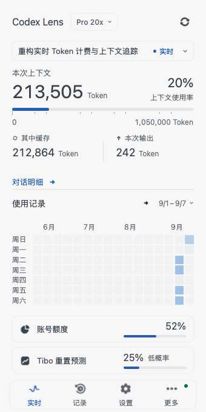
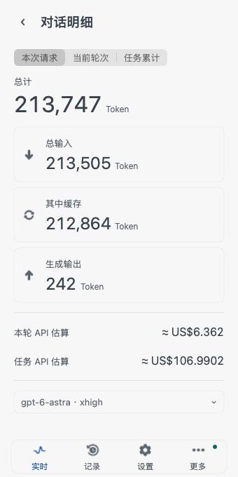

<p align="center">
  
</p>

<h1 align="center">Codex Token Ledger</h1>

<p align="center">
  <a href="#下载">下载</a> ·
  <a href="#数据">数据</a> ·
  <a href="#账号">账号</a> ·
  <a href="#开发">开发</a> ·
  <a href="#文档">文档</a>
</p>

<p align="center">
  
  
  
  
  <a href="LICENSE"></a>
  <a href="https://github.com/Lincb522/CodexTokenLedger/releases/tag/v2.1.1"></a>
</p>

<p align="center">
  
  
</p>

## 下载

[CodexTokenLedger-menu-bar-macOS.zip](https://github.com/Lincb522/CodexTokenLedger/releases/download/v2.1.1/CodexTokenLedger-menu-bar-macOS.zip) · [SHA256SUMS.txt](https://github.com/Lincb522/CodexTokenLedger/releases/download/v2.1.1/SHA256SUMS.txt)

macOS 14+ · x86_64 + arm64 · Developer ID 签名 · Apple 公证

## 数据

| 项目 | 来源或计算 |
| --- | --- |
| 活动任务 | `sessions` 中尚未完成的 rollout |
| 任务标题 | Desktop 目录、rollout 元数据、工作目录 |
| 当前请求 | 最新 `last_token_usage` |
| 当前轮次 | 本轮 `total_token_usage` 的有效增量 |
| 任务累计 | 最新 `total_token_usage` |
| 本地历史 | `sessions` 与可选 `archived_sessions` 的最终累计值 |
| 账号用量与额度 | Codex `app-server` |
| 费用 | 完整 Token 明细 × 模型费率 |
| 剩余时间 | 同一账号、同一额度窗口的历史样本 |
| Tibo | 预测与确认的公共重置信号；不计入账号额度 |

> [!NOTE]
> 无法确认的字段显示“不可用”。不按字符数估算 Token，不用本地会话推算账号额度。计算规则见 [Token 计算](docs/calculation-spec.md)。

## 账号

| 项目 | 支持内容或结果 |
| --- | --- |
| 导入 | OAuth · Codex Home · Token / API Key · `auth.json` · JSON / JSONL · Sub2 · CPA / CLIProxyAPI · Cockpit |
| 仅监控 | 不修改 Codex 当前登录 |
| 登录到 Codex | 备份后替换默认 Codex Home 的登录 |

## 开发

| 依赖 | 版本或用途 |
| --- | --- |
| macOS | 14+ |
| Xcode | 16+ |
| [XcodeGen](https://github.com/yonaskolb/XcodeGen) | 生成 Xcode 工程 |
| Codex CLI | 账号功能 |

<details>
<summary><strong>构建</strong></summary>

```bash
git clone https://github.com/Lincb522/CodexTokenLedger.git
cd CodexTokenLedger
xcodegen generate
./scripts/build_app.sh
```

```text
build/DerivedData/Build/Products/Release/CodexTokenLedger.app
```

```bash
CODESIGN_IDENTITY='Developer ID Application: …' ./scripts/package_release.sh
```

`package_release.sh` 只接受 Developer ID Application 身份。GitHub Release 工作流负责公证和装订票据。

</details>

<details>
<summary><strong>测试</strong></summary>

```bash
xcodegen generate
xcodebuild test \
  -project CodexTokenLedger.xcodeproj \
  -scheme CodexTokenLedger \
  -configuration Debug \
  -destination 'platform=macOS'
```

</details>

## 文档

| 产品 | 工程 |
| --- | --- |
| [产品约束](PRODUCT.md) | [系统结构](docs/architecture.md) |
| [界面规范](DESIGN.md) | [Token 计算](docs/calculation-spec.md) |
| [版本记录](CHANGELOG.md) | [开发与发布](docs/development.md) |
| [安全说明](SECURITY.md) | [验证记录](VERIFICATION.md) |

[全部文档](docs/README.md)

## 项目

| 项目 | 内容 |
| --- | --- |
| 开发者 | Zijiu522 |
| 许可 | [MIT](LICENSE) · [第三方许可](THIRD_PARTY_NOTICES.md) |
