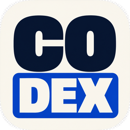
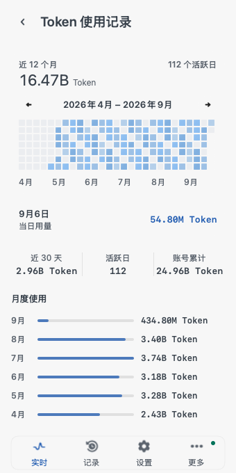

<p align="center">
  
</p>

<h1 align="center">Codex Lens</h1>

<p align="center">Codex 用量统计 · macOS 菜单栏应用</p>

<p align="center">
  <a href="https://github.com/Lincb522/CodexLens/releases/download/v2.5.2/Codex-Lens-macOS.dmg"><strong>下载 macOS 版</strong></a> ·
  <a href="CHANGELOG.md">更新日志</a> ·
  <a href="#开始使用">开始使用</a> ·
  <a href="#本地构建">本地构建</a>
</p>

<p align="center">
  
  
  
  
  <a href="LICENSE"></a>
  <a href="https://github.com/Lincb522/CodexLens/releases/tag/v2.5.2"></a>
</p>

<p align="center">
  <picture>
    <source media="(prefers-color-scheme: dark)" srcset="docs/images/overview-dark.png">
    
  </picture>
  <picture>
    <source media="(prefers-color-scheme: dark)" srcset="docs/images/usage-history-dark.png">
    
  </picture>
</p>

<p align="center"><sub>首页与使用记录 · 2.5.2 界面预览，使用示例数据。窗口毛玻璃以实机为准。</sub></p>

## 上下文、用量、额度

- **本次上下文**：最近一次请求的输入 Token，旁边显示上下文占用率、其中缓存和本次输出。首页主数不是任务累计。
- **对话明细**：在本次请求、当前轮次和任务累计之间切换，分别查看输入、缓存、输出与 API 估算。
- **每日记录**：一格一天，悬停查看日期和用量。首页可选本月、近 7 天、近 30 天或自选范围；点进记录查看全年热力图和月度汇总。
- **账号额度**：首页显示剩余进度，详情列出额度周期、重置时间、积分和美元估算；模型专属额度单独展示。
- **Tibo 动态**：重置预测、最近确认记录、推文与回复原文。它与账号自身的额度周期分开，预测不代表官方排期。

<details>
<summary><strong>查看对话明细</strong></summary>

<p align="center">
  <picture>
    <source media="(prefers-color-scheme: dark)" srcset="docs/images/token-details-dark.png">
    
  </picture>
</p>

</details>

缓存已包含在输入中，不重复相加。Token 计数来自 Codex 记录和账号接口；费用与额度的美元值是估算，不是账单。完整口径见 [Token 计算](docs/calculation-spec.md)。

## 开始使用

1. 准备好已登录的 Codex CLI（终端中的 `codex` 命令）。
2. 下载 [DMG 安装包](https://github.com/Lincb522/CodexLens/releases/download/v2.5.2/Codex-Lens-macOS.dmg)，将 **Codex Lens** 拖入「应用程序」并打开。
3. 点击菜单栏图标查看。没有读到记录时，在「设置 → 数据」中选择 Codex Home。

默认读取 `CODEX_HOME`，未设置时使用 `~/.codex`。多个账号可分别导入；“仅监控”不切换 Codex 登录，“登录到 Codex”会先备份原登录文件，再替换。

设置中可以切换浅色 / 深色、开启开机自启，以及选择 Token **完整数字或 K / M / B / T 简写**。在「更多 → 关于 → 检查更新」查看 GitHub 发布的新版本与更新日志。

**安装要求：** macOS 14 及以上，支持 Apple Silicon 和 Intel。当前发布包有 Developer ID 签名，尚未通过 Apple 公证。

[ZIP 下载](https://github.com/Lincb522/CodexLens/releases/download/v2.5.2/Codex-Lens-macOS.zip) · [SHA-256 校验文件](https://github.com/Lincb522/CodexLens/releases/download/v2.5.2/SHA256SUMS.txt)

<details>
<summary>账号导入格式</summary>

支持 Codex Home、`auth.json`、OAuth JSON、Token / API Key、JSON / JSONL，以及 CPA / CLIProxyAPI、Sub2、Cockpit 格式。

</details>

## 本地构建

安装 Xcode 和 [XcodeGen](https://github.com/yonaskolb/XcodeGen)。CI 使用 Xcode 26.3；`project.yml` 是工程定义，`.xcodeproj` 由脚本生成。

```bash
git clone https://github.com/Lincb522/CodexLens.git
cd CodexLens
./scripts/build_app.sh
```

构建产物：`build/DerivedData/Build/Products/Release/Codex Lens.app`。本地构建脚本不签名；签名与打包见 [开发与发布](docs/development.md)。

<details>
<summary><strong>运行测试</strong></summary>

```bash
xcodegen generate
xcodebuild test \
  -project CodexTokenLedger.xcodeproj \
  -scheme CodexTokenLedger \
  -configuration Debug \
  -destination 'platform=macOS'
```

</details>

## 文档与项目

[全部文档](docs/README.md) · [Token 计算](docs/calculation-spec.md) · [系统结构](docs/architecture.md) · [界面规范](DESIGN.md) · [验证记录](VERIFICATION.md)

[参与开发](CONTRIBUTING.md) · [报告问题](https://github.com/Lincb522/CodexLens/issues) · [安全说明](SECURITY.md)

作者：**Zijiu522**。采用 [MIT License](LICENSE)，第三方组件见 [许可清单](THIRD_PARTY_NOTICES.md)。
